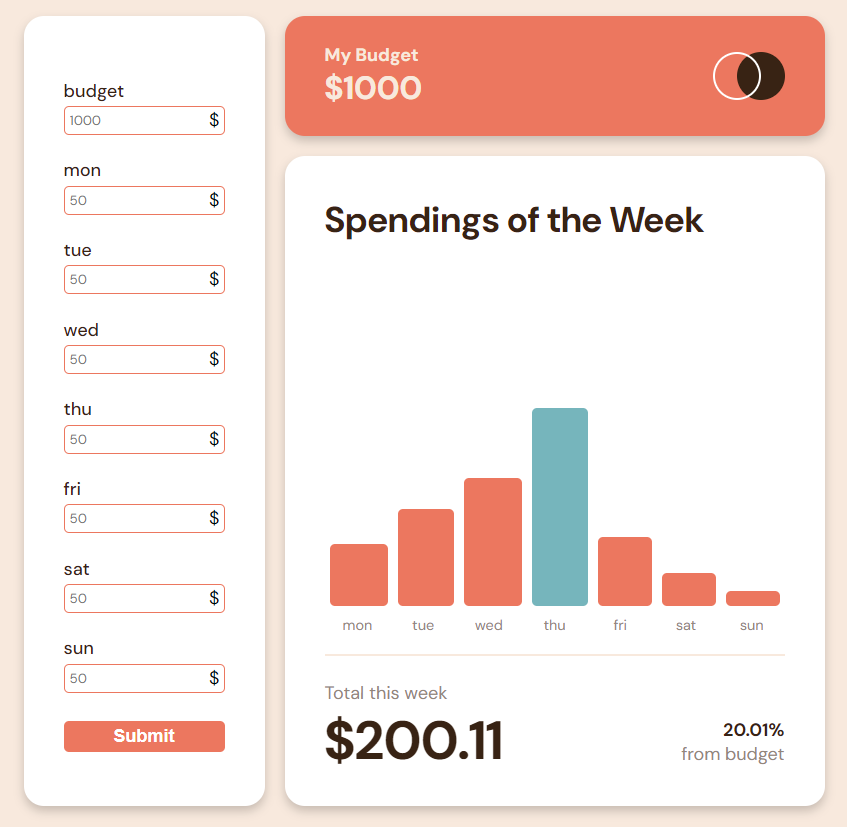

# Expenses Chart Component

This project is an extension of the original Expenses Chart Component challenge. In addition to the requirements specified in the original challenge, new features and functionalities have been added to enhance the user experience and provide additional functionality.

## Table of Contents

- [Overview](#overview)
  - [The Original Challenge](#the-original-challenge)
  - [Screenshot](#screenshot)
  - [Links](#links)
- [New Features](#new-features)
- [My Process](#my-process)
  - [Built With](#built-with)
- [Author](#author)

## Overview

### The Original Challenge

The original challenge aimed to create an expenses chart component where users can view a bar chart, hover over individual bars to see the amounts for each day, and view the current day's bar highlighted in a different color. The solution was built using Semantic HTML5 markup, CSS custom properties, Flexbox and React.

### Screenshot

### Links

- [Solution URL](https://github.com/meisteraxel/expenses-chart)
- [Live Site URL](https://expenses-tracker-axmst.netlify.app/){:target="\_blank"}

## New Features

- [x] User should have an input for his expenses
- [x] User is able to update his expenses
- [x] User is able to update only single days or only his budget and keeping all other values
- [ ] Save expenses to local storage so User can return to the App
- [x] User is able to reset all expenses and the budget
- [x] User can see his remaining budget
- [ ] more to come...

## My Process

### Built With

- Semantic HTML5 markup
- CSS custom properties
- Flexbox
- React

## Author

- Frontend Mentor - [@meisteraxel](https://www.frontendmentor.io/profile/meisteraxel)
- Twitter - [@axmste](https://twitter.com/axmste)
