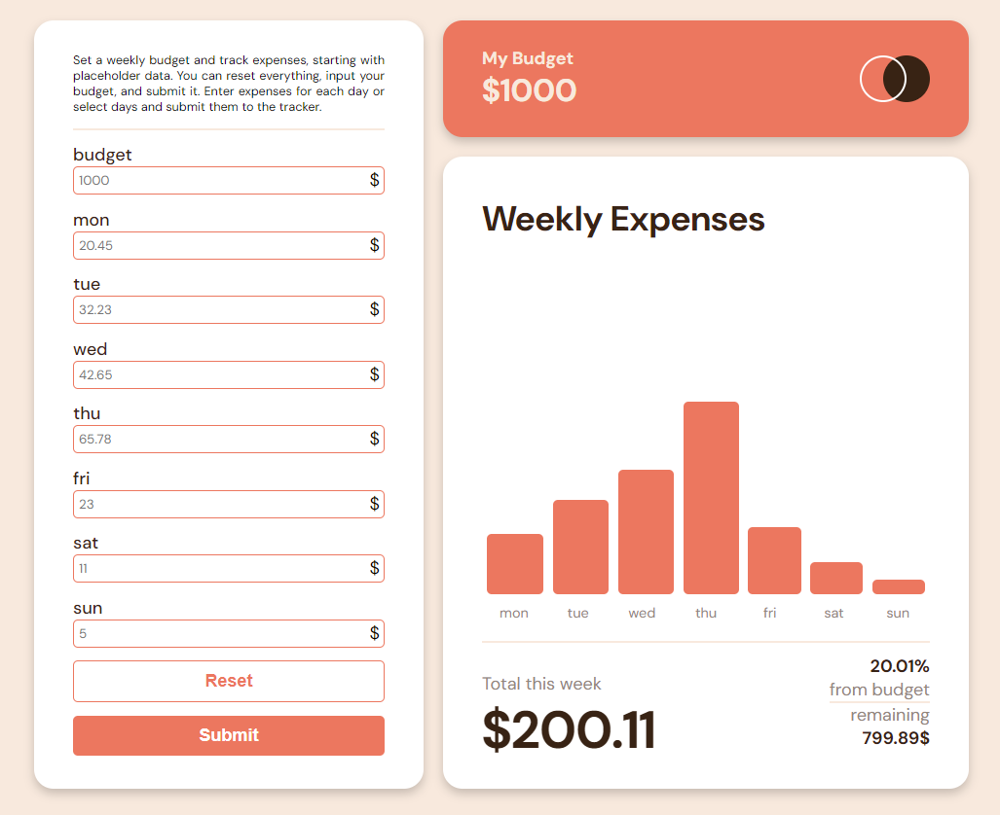

# Expenses Chart Component

This project started as a solution to the Expenses Chart Component challenge on Frontend Mentor. Frontend Mentor challenges help improve coding skills by building realistic projects. The original challenge can be found [here](https://github.com/meisteraxel/expenses-chart-component-main).

## Table of Contents

- [Overview](#overview)
  - [The Original Challenge](#the-original-challenge)
  - [Screenshot](#screenshot)
  - [Links](#links)
- [New Features](#new-features)
- [My Process](#my-process)
  - [Built With](#built-with)
- [Author](#author)

## Overview

### The Original Challenge

The original challenge aimed to create an expenses chart component where users can view a bar chart, hover over individual bars to see the amounts for each day, and view the current day's bar highlighted in a different color. The solution was built using Semantic HTML5 markup, CSS custom properties, Flexbox, CSS Grid, and React.

### Screenshot

### Links

- [Original Solution URL](https://github.com/meisteraxel/expenses-chart-component-main)
- [Original Live Site URL](https://expenses-chart-component-axmst.netlify.app/)

## New Features

- [ ] User should have an input for his expenses
- [ ] more to come...

## My Process

### Built With

- Semantic HTML5 markup
- CSS custom properties
- Flexbox
- CSS Grid
- React

## Author

- Frontend Mentor - [@meisteraxel](https://www.frontendmentor.io/profile/meisteraxel)
- Twitter - [@axmste](https://twitter.com/axmste)
